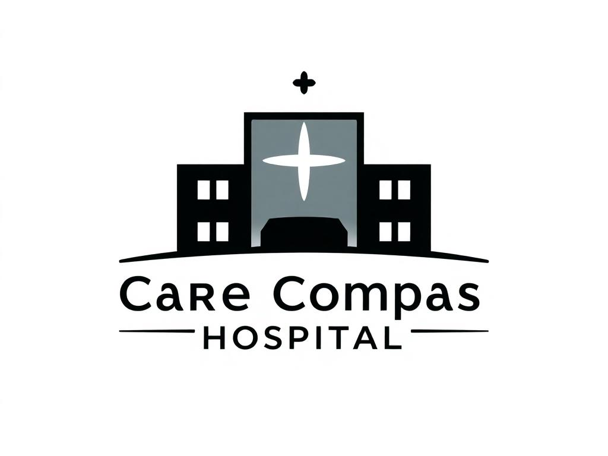

# CareCompass Hospital Management System

A comprehensive hospital management system built with PHP and MySQL, designed to streamline healthcare operations including patient care, staff management, appointments, and administrative functions.



## 🏥 Project Overview

CareCompass Hospital is a full-featured hospital management system that provides a complete solution for healthcare facilities. The system supports multiple user roles, appointment scheduling, doctor management, inventory tracking, and comprehensive reporting.

## ✨ Key Features

### 🔐 Multi-Role User Management
- **Patients**: Registration, appointment booking, profile management
- **Staff**: Task management, supply requests, patient check-ins
- **Administrators**: Complete system management and analytics

### 📅 Appointment Management
- Appointment booking with conflict detection
- Doctor availability tracking
- Automatic PDF receipt generation
- Appointment status tracking

### 👨‍⚕️ Doctor Management
- Complete doctor profiles with images
- Specialization and branch management
- Availability scheduling
- Search and filter functionality


### 📦 Inventory & Supply Management
- Medical supplies tracking
- Staff supply request system
- Admin approval workflow
- Real-time inventory updates

### 📊 Analytics & Reporting
- Patient volume analytics
- Staff efficiency metrics
- Bed availability tracking
- Admission rate monitoring

## 🛠️ Technology Stack

- **Backend**: PHP
- **Database**: MySQL
- **Frontend**: HTML, CSS, JavaScript
- **PDF Generation**: FPDF Library
- **Server**: XAMPP Environment

## 📁 Project Structure

```
CareCompassHospital/
├── assets/                    # Images and media files
│   ├── logo.jpeg             # Hospital logo
│   ├── hero1.jpeg            # Hero slider images
│   ├── hero2.jpeg
│   ├── hero3.jpeg
│   ├── fb.png                # Social media icons
│   ├── twitter.png
│   ├── instagram.png
│   └── staff.jpg             # Staff images
├── php/                      # PHP application files
│   ├── config.php            # Database configuration
│   ├── login.php             # User authentication
│   ├── register.php          # Patient registration
│   ├── admin-dashboard.php   # Admin control panel
│   ├── staff-dashboard.php   # Staff dashboard
│   ├── patient-dashboard.php # Patient dashboard
│   ├── book-appointment.php  # Appointment booking
│   ├── doctors-dashboard.php # Doctor management
│   ├── manage-inventory.php  # Inventory management
│   ├── assign-tasks.php      # Task assignment
│   ├── request-supplies.php  # Supply requests
│   ├── fpdf.php              # PDF generation library
│   ├── uploads/              # User uploaded files
│   └── tutorial/             # FPDF documentation
├── index.php                 # Main homepage
├── care_compass_db.sql       # Database schema
└── README.md                 # Project documentation
```


**CareCompass Hospital Management System** - Making healthcare management efficient and accessible.

*Last updated: February 2025* 
